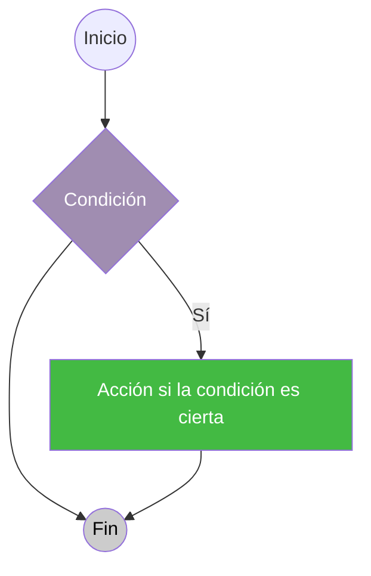
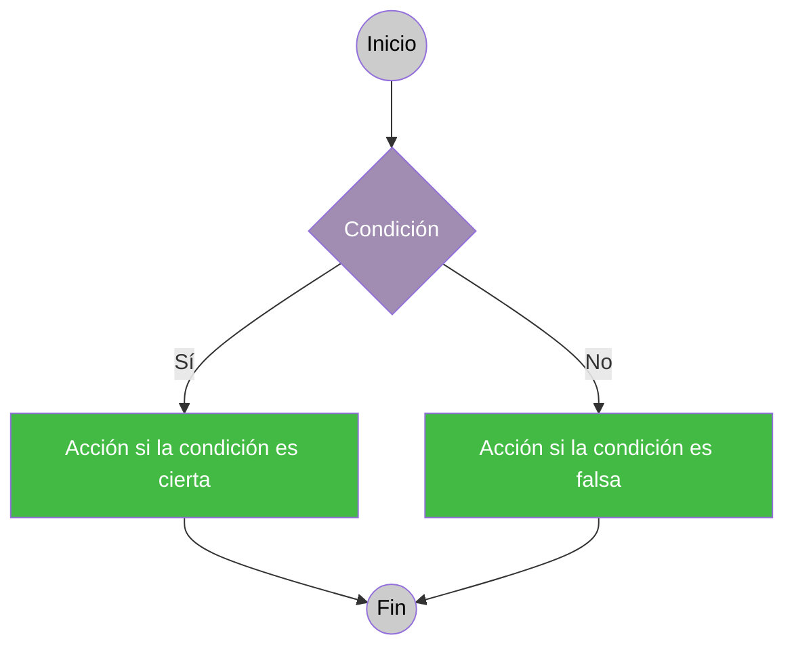
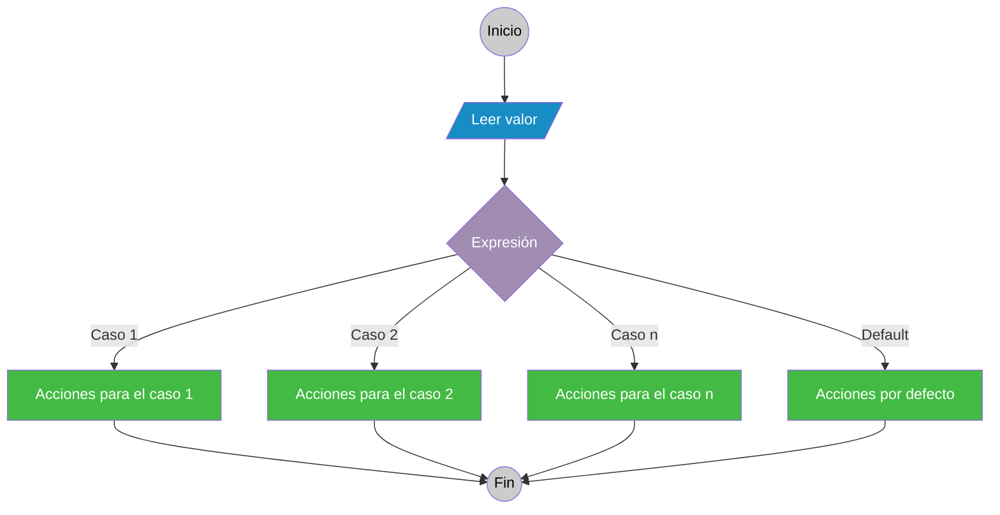

# 2. Estructuras alternativas

Como ya vimos, las estructuras alternativas son construcciones que permiten alterar el flujo secuencial de un programa de manera que, en función de una condición o del valor de una expresión, este pueda ser desviado hacia una u otra alternativa de código. Las estructuras alternativas disponibles en la mayoría de los lenguajes de programación son:

- Alternativa Simple
- Alternativa Doble
- Alternativa Múltiple

## 2.1. Estructura alternativa simple

La alternativa simple se codifica de la siguiente forma:



::: tabs
== Java

```java
if (condición){
    //Acciones
}
```

El bloque de Acciones se ejecuta si la condición se evalúa a true (es verdadera).

```java
if (cont == 0){
    System.out.println("cont es 0");
    //más instrucciones...
}
```

Si dentro de la estructura solo hay una instrucción, no es necesario poner las llaves.

```java
if (cont == 0) System.out.println("cont es 0");
```

:::

## 2.2. Estructura alternativa Doble

La alternativa doble permite indicar qué código ejecutar si la condición es falsa.



::: tabs
== Java

```java
if (condición){
    // AccionesSI
} else {
    // AccionesNO
}
```

El bloque AccionesSI se ejecuta si la condición se evalúa a true (verdadera). En caso contrario, se ejecuta el bloque de AccionesNO.

```java
if (cont == 0){
    System.out.println("cont es 0");
    // más instrucciones...
} else {
    System.out.println("cont no es 0");
    // más instrucciones...
}
```

Si dentro de la estructura solo hay una instrucción, no es necesario poner las llaves.

```java
if (cont == 0) System.out.println("cont es 0");
else System.out.println("cont no es 0");
```

:::

::: tip **¡IMPORTANTE!**

Recordad que el operador relacional para comprobar si son iguales varía según el lenguaje, pero generalmente se utiliza un operador específico para la comparación que es diferente del operador de asignación. Este error no siempre lo detecta el compilador y es difícil de descubrir.

:::

En muchas ocasiones, se encadenan estructuras alternativas, de manera que se pregunta por una condición si anteriormente no se ha cumplido otra sucesivamente.

>**Ejemplo:**  
>Supongamos que realizamos un programa que muestra la nota de un alumno en la forma (insuficiente, suficiente, bien, notable o sobresaliente) en función de su nota numérica. Podría codificarse de la siguiente forma:
>
>:::: tabs
>=== Java
>
>::: tabs
>== Código
>
>```java
>import java.util.Scanner;
>
>public class Nota{
>
>   public static void main(String[] args){
>
>     Scanner entrada = new Scanner (System.in);
>     int nota;
>     //Suponemos que el usuario introduce el número correctamente
>     //No hacemos comprobaciones
>     System.out.println ("Dame un número entre 0 y 10");
>     nota = entrada.nextInt();
>
>     if (nota < 5) {
>       System.out.println ("Insuficiente");
>     } else if (nota < 6) {
>       System.out.println ("Suficiente");
>     } else if (nota < 7) {
>       System.out.println ("Bien");
>     } else if (nota < 9) {
>       System.out.println ("Notable");
>     } else {
>       System.out.println ("Sobresaliente");
>     }
>  }
>}
>
>```
>
>== Salida
>
>```
>Dame un número entre 0 y 10
>8
>Notable
>```
>
>:::
>::::

Es muy recomendable usar la tecla tabulador en las instrucciones de cada bloque. Como se puede ver en el ejemplo, cada bloque de alternativa está alineado adecuadamente; de esta manera es más fácil leer el código.

::: info Importante
Para simplificar la comprensión del código, existen lenguajes que permiten el uso del **operador condicional** (también conocido como operador ternario) para realizar operaciones condicionales de manera más concisa. Este operador es útil para asignar valores a variables en función de una condición, evitando estructuras alternativas más largas.
👉 **Consulta el apartado "[Operador condicional](/13-operador_cond)"** para conocer cómo se utiliza el operador condicional.
:::

## 2.3. Estructura Alternativa Múltiple



::: tabs
== Java

```java
switch (selector) {
    case valor1:
        // Acciones para el caso 1
        break;
    case valor2:
        // Acciones para el caso 2
        break;
    // ...
    default:
        // Acciones por defecto
}
```

En esta estructura, el valor del **selector** se compara con cada etiqueta de caso. Cuando coincide con un **valor**, se ejecutan las acciones correspondientes hasta el `break`, que hace que el flujo salga de la estructura. Si ningún caso coincide, se ejecuta el bloque por defecto.

```java
switch (diaSetmana) {
    case "dilluns":
        System.out.println("Hoy es lunes");
        break;
    case "divendres":
        System.out.println("Hoy es viernes");
        break;
    default:
        System.out.println("Es otro día de la semana");
}
```

En este ejemplo, según el contenido de la variable `diaSetmana`, se imprime un mensaje diferente. La instrucción de ruptura impide que se continúe en los siguientes casos.

:::

Es muy importante entender que **en la estructura alternativa múltiple se evalúa una expresión** (un valor concreto como 0, 5, 1…) **no una condición** (verdadera o falsa) como en las alternativas simples y dobles.

El programa comprueba el valor de la expresión y saltará al caso que corresponda con ese valor, ejecutando el código correspondiente. Si no coincide ningún valor, saltará al caso por defecto y ejecutará las acciones establecidas.

Es importante añadir la sentencia de ruptura al final de cada caso, ya que, en caso contrario, el programa continuará ejecutando el código de las otras acciones y normalmente no querremos que haga eso (aunque muchos lenguajes permiten hacerlo, es confuso y por eso está desaconsejado).

>**Ejemplo de la estructura alternativa múltiple en código:**  
>
>:::: tabs
>=== Java
>
>::: tabs
>== Código
>
>```java
>import java.util.Scanner;
>
>public class Alternativa_Multiple{
>
>   public static void main(String[] args){
>
>     Scanner entrada = new Scanner (System.in);
>     int dia;
>
>     System.out.println ("Dame un número entre 1 y 7");
>     dia = entrada.nextInt();
>
>     switch (dia) {
>       case 1:
>         System.out.println ("Lunes"); break;
>       case 2: 
>         System.out.println ("Martes"); break;
>       case 3:
>         System.out.println ("Miércoles"); break;
>       case 4:
>         System.out.println ("Jueves"); break;
>       case 5: 
>         System.out.println ("Viernes"); break;
>       case 6:
>         System.out.println ("Sábado"); break;
>       case 7:
>         System.out.println ("Domingo"); break;
>       default:
>         System.out.println("Error, el número debe estar entre 1 y 7");
>     }
>  }
>}
>```
>
>== Salida
>
>```
>Dame un número entre 1 y 7
>4
>Jueves
>```
>
>:::
>::::